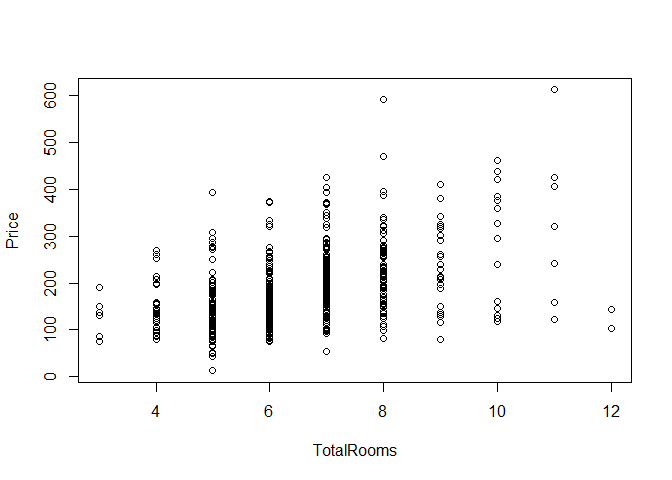

Ames Housing Prices
================
Brian Yi, Alexa Edwards, Erica Chen, Minerva Fang

Introduction
============

This project focuses on building a model for the Ames Housing dataset to predict housing prices. We first select a model through backward elimination, forward selection, and stepwise regression. Then we conduct residual analysis for this model to identify outliers. We then take our model out for a run to predict a housing price to see if the results are reasonable.

Next, we transform our model such that predictors will have a stronger correlation with our dependent variable, price. We finally conduct some cross-validation on our non-transformed model to see if our model does well in predicting on a test dataset.

Part 1. Build an initial basic model
====================================

### Mallow's Cp and adjusted R-squared

We decide to use four methods to determine which model is best suited for predicting the price of a house in Ames, Iowa. Our first method investigates the adjusted R-squared values and Mallow's Cp for the best subsets.

``` r
# Model with all the variables before selection
Full = lm(formula = Price ~ LotFrontage + LotArea + Quality + Condition + YearBuilt + YearRemodel + BasementSF + GroundSF + BasementFBath + BasementHBath + FullBath + HalfBath + Bedroom + TotalRooms + Fireplaces + GarageCars + GarageSF + WoodDeckSF + OpenPorchSF + EnclosedPorchSF + ScreenPorchSF, data = Ames)

# Mallow's Cp and Adjusted R-squared selection
all = regsubsets(Price ~ LotFrontage + LotArea + Quality + Condition + YearBuilt + YearRemodel + BasementSF + GroundSF + BasementFBath + BasementHBath + FullBath + HalfBath + Bedroom + TotalRooms + Fireplaces + GarageCars + GarageSF + WoodDeckSF + OpenPorchSF + EnclosedPorchSF + ScreenPorchSF, data = Ames, nbest = 2, nvmax = 30)

# Visualization of our method
ShowSubsets=function(regout){
  z=summary(regout)
  q=as.data.frame(z$outmat)
  q$Rsq=round(z$rsq*100,2)
  q$adjRsq=round(z$adjr2*100,2)
  q$Cp=round(z$cp,2)
  return(q)
}

ShowSubsets(all)
```

    ##           LotFrontage LotArea Quality Condition YearBuilt YearRemodel
    ## 1  ( 1 )                            *                                
    ## 1  ( 2 )                                                             
    ## 2  ( 1 )                            *                                
    ## 2  ( 2 )                            *                                
    ## 3  ( 1 )                            *                                
    ## 3  ( 2 )                            *                                
    ## 4  ( 1 )                            *                                
    ## 4  ( 2 )                            *                   *            
    ## 5  ( 1 )                            *                   *            
    ## 5  ( 2 )                    *       *                                
    ## 6  ( 1 )                    *       *                   *            
    ## 6  ( 2 )                    *       *                                
    ## 7  ( 1 )                    *       *                   *            
    ## 7  ( 2 )                    *       *                   *            
    ## 8  ( 1 )                    *       *                   *            
    ## 8  ( 2 )                    *       *                   *            
    ## 9  ( 1 )                    *       *                   *           *
    ## 9  ( 2 )                    *       *         *         *            
    ## 10  ( 1 )           *       *       *                   *           *
    ## 10  ( 2 )           *       *       *         *         *            
    ## 11  ( 1 )           *       *       *         *         *            
    ## 11  ( 2 )           *       *       *                   *           *
    ## 12  ( 1 )           *       *       *         *         *            
    ## 12  ( 2 )           *       *       *         *         *            
    ## 13  ( 1 )           *       *       *         *         *            
    ## 13  ( 2 )           *       *       *         *         *           *
    ## 14  ( 1 )           *       *       *         *         *           *
    ## 14  ( 2 )           *       *       *         *         *           *
    ## 15  ( 1 )           *       *       *         *         *           *
    ## 15  ( 2 )           *       *       *         *         *           *
    ## 16  ( 1 )           *       *       *         *         *           *
    ## 16  ( 2 )           *       *       *         *         *           *
    ## 17  ( 1 )           *       *       *         *         *           *
    ## 17  ( 2 )           *       *       *         *         *           *
    ## 18  ( 1 )           *       *       *         *         *           *
    ## 18  ( 2 )           *       *       *         *         *           *
    ## 19  ( 1 )           *       *       *         *         *           *
    ## 19  ( 2 )           *       *       *         *         *           *
    ## 20  ( 1 )           *       *       *         *         *           *
    ## 20  ( 2 )           *       *       *         *         *           *
    ## 21  ( 1 )           *       *       *         *         *           *
    ##           BasementSF GroundSF BasementFBath BasementHBath FullBath
    ## 1  ( 1 )                                                          
    ## 1  ( 2 )                    *                                     
    ## 2  ( 1 )                    *                                     
    ## 2  ( 2 )           *                                              
    ## 3  ( 1 )           *        *                                     
    ## 3  ( 2 )                    *             *                       
    ## 4  ( 1 )           *        *             *                       
    ## 4  ( 2 )           *        *                                     
    ## 5  ( 1 )           *        *             *                       
    ## 5  ( 2 )           *        *             *                       
    ## 6  ( 1 )           *        *             *                       
    ## 6  ( 2 )           *        *             *                       
    ## 7  ( 1 )           *        *             *                       
    ## 7  ( 2 )           *        *             *                       
    ## 8  ( 1 )           *        *             *                       
    ## 8  ( 2 )           *        *             *                       
    ## 9  ( 1 )           *        *             *                       
    ## 9  ( 2 )           *        *             *                       
    ## 10  ( 1 )          *        *             *                       
    ## 10  ( 2 )          *        *             *                       
    ## 11  ( 1 )          *        *             *                       
    ## 11  ( 2 )          *        *             *                       
    ## 12  ( 1 )          *        *             *                       
    ## 12  ( 2 )          *        *             *                       
    ## 13  ( 1 )          *        *             *                       
    ## 13  ( 2 )          *        *             *                       
    ## 14  ( 1 )          *        *             *                       
    ## 14  ( 2 )          *        *             *                      *
    ## 15  ( 1 )          *        *             *                      *
    ## 15  ( 2 )          *        *             *                       
    ## 16  ( 1 )          *        *             *             *        *
    ## 16  ( 2 )          *        *             *                      *
    ## 17  ( 1 )          *        *             *                      *
    ## 17  ( 2 )          *        *             *             *        *
    ## 18  ( 1 )          *        *             *             *        *
    ## 18  ( 2 )          *        *             *             *        *
    ## 19  ( 1 )          *        *             *             *        *
    ## 19  ( 2 )          *        *             *             *        *
    ## 20  ( 1 )          *        *             *             *        *
    ## 20  ( 2 )          *        *             *             *        *
    ## 21  ( 1 )          *        *             *             *        *
    ##           HalfBath Bedroom TotalRooms Fireplaces GarageCars GarageSF
    ## 1  ( 1 )                                                            
    ## 1  ( 2 )                                                            
    ## 2  ( 1 )                                                            
    ## 2  ( 2 )                                                            
    ## 3  ( 1 )                                                            
    ## 3  ( 2 )                                                            
    ## 4  ( 1 )                                                            
    ## 4  ( 2 )                                                            
    ## 5  ( 1 )                                                            
    ## 5  ( 2 )                                                            
    ## 6  ( 1 )                                                            
    ## 6  ( 2 )                                                           *
    ## 7  ( 1 )                                                           *
    ## 7  ( 2 )                 *                                          
    ## 8  ( 1 )                                       *                   *
    ## 8  ( 2 )                 *                                         *
    ## 9  ( 1 )                                       *                   *
    ## 9  ( 2 )                                       *                   *
    ## 10  ( 1 )                                      *                   *
    ## 10  ( 2 )                                      *                   *
    ## 11  ( 1 )                *                     *                   *
    ## 11  ( 2 )                *                     *                   *
    ## 12  ( 1 )                *                     *                   *
    ## 12  ( 2 )                *          *          *                   *
    ## 13  ( 1 )                *          *          *                   *
    ## 13  ( 2 )                *                     *                   *
    ## 14  ( 1 )                *          *          *                   *
    ## 14  ( 2 )                *          *          *                   *
    ## 15  ( 1 )                *          *          *                   *
    ## 15  ( 2 )        *       *          *          *                   *
    ## 16  ( 1 )                *          *          *                   *
    ## 16  ( 2 )                *          *          *                   *
    ## 17  ( 1 )                *          *          *                   *
    ## 17  ( 2 )                *          *          *                   *
    ## 18  ( 1 )                *          *          *                   *
    ## 18  ( 2 )        *       *          *          *                   *
    ## 19  ( 1 )        *       *          *          *                   *
    ## 19  ( 2 )                *          *          *                   *
    ## 20  ( 1 )        *       *          *          *                   *
    ## 20  ( 2 )        *       *          *          *          *        *
    ## 21  ( 1 )        *       *          *          *          *        *
    ##           WoodDeckSF OpenPorchSF EnclosedPorchSF ScreenPorchSF   Rsq
    ## 1  ( 1 )                                                       65.83
    ## 1  ( 2 )                                                       48.42
    ## 2  ( 1 )                                                       74.27
    ## 2  ( 2 )                                                       71.81
    ## 3  ( 1 )                                                       79.86
    ## 3  ( 2 )                                                       77.67
    ## 4  ( 1 )                                                       81.29
    ## 4  ( 2 )                                                       81.28
    ## 5  ( 1 )                                                       82.41
    ## 5  ( 2 )                                                       82.39
    ## 6  ( 1 )                                                       83.51
    ## 6  ( 2 )                                                       83.31
    ## 7  ( 1 )                                                       84.06
    ## 7  ( 2 )                                                       83.93
    ## 8  ( 1 )                                                       84.44
    ## 8  ( 2 )                                                       84.38
    ## 9  ( 1 )                                                       84.71
    ## 9  ( 2 )                                                       84.69
    ## 10  ( 1 )                                                      84.93
    ## 10  ( 2 )                                                      84.93
    ## 11  ( 1 )                                                      85.19
    ## 11  ( 2 )                                                      85.11
    ## 12  ( 1 )                                                    * 85.30
    ## 12  ( 2 )                                                      85.29
    ## 13  ( 1 )                                                    * 85.41
    ## 13  ( 2 )                                                    * 85.40
    ## 14  ( 1 )                                                    * 85.49
    ## 14  ( 2 )                                                      85.46
    ## 15  ( 1 )                                                    * 85.56
    ## 15  ( 2 )                                                    * 85.52
    ## 16  ( 1 )                                                    * 85.59
    ## 16  ( 2 )          *                                         * 85.59
    ## 17  ( 1 )          *                           *             * 85.61
    ## 17  ( 2 )                                      *             * 85.61
    ## 18  ( 1 )          *                           *             * 85.64
    ## 18  ( 2 )                                      *             * 85.62
    ## 19  ( 1 )          *                           *             * 85.64
    ## 19  ( 2 )          *           *               *             * 85.64
    ## 20  ( 1 )          *           *               *             * 85.65
    ## 20  ( 2 )          *                           *             * 85.64
    ## 21  ( 1 )          *           *               *             * 85.65
    ##           adjRsq      Cp
    ## 1  ( 1 )   65.77  780.09
    ## 1  ( 2 )   48.34 1480.98
    ## 2  ( 1 )   74.18  442.23
    ## 2  ( 2 )   71.71  541.23
    ## 3  ( 1 )   79.76  219.13
    ## 3  ( 2 )   77.56  307.32
    ## 4  ( 1 )   81.16  163.51
    ## 4  ( 2 )   81.16  163.81
    ## 5  ( 1 )   82.26  120.36
    ## 5  ( 2 )   82.25  121.01
    ## 6  ( 1 )   83.34   77.99
    ## 6  ( 2 )   83.14   85.98
    ## 7  ( 1 )   83.88   57.73
    ## 7  ( 2 )   83.74   63.26
    ## 8  ( 1 )   84.23   44.72
    ## 8  ( 2 )   84.17   46.82
    ## 9  ( 1 )   84.48   35.54
    ## 9  ( 2 )   84.45   36.58
    ## 10  ( 1 )  84.67   28.83
    ## 10  ( 2 )  84.67   28.85
    ## 11  ( 1 )  84.92   20.29
    ## 11  ( 2 )  84.83   23.60
    ## 12  ( 1 )  85.00   17.88
    ## 12  ( 2 )  84.99   18.28
    ## 13  ( 1 )  85.08   15.68
    ## 13  ( 2 )  85.07   16.12
    ## 14  ( 1 )  85.14   14.29
    ## 14  ( 2 )  85.11   15.50
    ## 15  ( 1 )  85.19   13.31
    ## 15  ( 2 )  85.15   15.05
    ## 16  ( 1 )  85.19   14.36
    ## 16  ( 2 )  85.19   14.39
    ## 17  ( 1 )  85.19   15.38
    ## 17  ( 2 )  85.19   15.38
    ## 18  ( 1 )  85.19   16.46
    ## 18  ( 2 )  85.18   17.02
    ## 19  ( 1 )  85.17   18.08
    ## 19  ( 2 )  85.17   18.34
    ## 20  ( 1 )  85.15   20.00
    ## 20  ( 2 )  85.15   20.08
    ## 21  ( 1 )  85.13   22.00

The highest R-squared value is generally desired and we see that several models have the highest R-squared value of 85.19. However, the R-squared values depend only on the predictors in the model so looking at Mallow's Cp will shed light on the impact of predictors not in the model. As a general rule, a smaller Mallow's Cp is preferred. Model 15(1) has the lowest Cp of 13.31, while still having the higest R-squared value of 85.19, indicating that it is the best subset by this method.

Our best model based off of R-squared and Mallow's Cp is the following:

``` r
# Best model from our first method
modAmes = lm(formula = Price ~ LotFrontage + LotArea + Quality + Condition + YearBuilt + 
    YearRemodel + BasementSF + GroundSF + BasementFBath + FullBath + 
    Bedroom + TotalRooms + Fireplaces + GarageSF + ScreenPorchSF, data = Ames)
```

We now run backward elimination, forward selection, and stepwise regression to see what other models are good.

Backward Elimination
--------------------

The next method we used is backward elimination because it requires fitting fewer models but still leaves us with only significant predictors. Backward elimination takes out any predictor that has a P-value above 5% step by step until we reach our desired model.

``` r
# Backward elimination
MSE = (summary(Full)$sigma)^2
step(Full, scale = MSE)
```

    ## Start:  AIC=22
    ## Price ~ LotFrontage + LotArea + Quality + Condition + YearBuilt + 
    ##     YearRemodel + BasementSF + GroundSF + BasementFBath + BasementHBath + 
    ##     FullBath + HalfBath + Bedroom + TotalRooms + Fireplaces + 
    ##     GarageCars + GarageSF + WoodDeckSF + OpenPorchSF + EnclosedPorchSF + 
    ##     ScreenPorchSF
    ## 
    ##                   Df Sum of Sq    RSS      Cp
    ## - GarageCars       1         1 531673  20.001
    ## - OpenPorchSF      1        76 531748  20.082
    ## - HalfBath         1       313 531985  20.340
    ## - WoodDeckSF       1       898 532569  20.976
    ## - BasementHBath    1       906 532578  20.985
    ## - EnclosedPorchSF  1       941 532612  21.023
    ## - FullBath         1      1826 533498  21.986
    ## <none>                         531672  22.000
    ## - ScreenPorchSF    1      3364 535035  23.657
    ## - YearRemodel      1      3903 535575  24.243
    ## - TotalRooms       1      4269 535941  24.641
    ## - GarageSF         1      4666 536338  25.073
    ## - Condition        1      5210 536881  25.664
    ## - Fireplaces       1      9063 540735  29.853
    ## - LotFrontage      1      9331 541003  30.145
    ## - Bedroom          1      9394 541066  30.212
    ## - BasementFBath    1     21221 552893  43.071
    ## - YearBuilt        1     23034 554706  45.041
    ## - LotArea          1     25963 557635  48.225
    ## - GroundSF         1     59609 591281  84.804
    ## - BasementSF       1     65785 597456  91.517
    ## - Quality          1     79104 610776 105.997
    ## 
    ## Step:  AIC=20
    ## Price ~ LotFrontage + LotArea + Quality + Condition + YearBuilt + 
    ##     YearRemodel + BasementSF + GroundSF + BasementFBath + BasementHBath + 
    ##     FullBath + HalfBath + Bedroom + TotalRooms + Fireplaces + 
    ##     GarageSF + WoodDeckSF + OpenPorchSF + EnclosedPorchSF + ScreenPorchSF
    ## 
    ##                   Df Sum of Sq    RSS      Cp
    ## - OpenPorchSF      1        75 531748  18.083
    ## - HalfBath         1       315 531988  18.344
    ## - WoodDeckSF       1       897 532570  18.977
    ## - BasementHBath    1       908 532581  18.988
    ## - EnclosedPorchSF  1       947 532620  19.031
    ## - FullBath         1      1835 533507  19.996
    ## <none>                         531673  20.001
    ## - ScreenPorchSF    1      3363 535036  21.657
    ## - YearRemodel      1      3903 535575  22.244
    ## - TotalRooms       1      4304 535977  22.681
    ## - Condition        1      5210 536882  23.665
    ## - Fireplaces       1      9119 540792  27.915
    ## - LotFrontage      1      9333 541006  28.148
    ## - Bedroom          1      9425 541098  28.248
    ## - GarageSF         1     13019 544692  32.155
    ## - BasementFBath    1     21230 552903  41.081
    ## - YearBuilt        1     23349 555022  43.385
    ## - LotArea          1     26020 557693  46.288
    ## - GroundSF         1     59609 591281  82.804
    ## - BasementSF       1     65837 597510  89.575
    ## - Quality          1     79400 611073 104.320
    ## 
    ## Step:  AIC=18.08
    ## Price ~ LotFrontage + LotArea + Quality + Condition + YearBuilt + 
    ##     YearRemodel + BasementSF + GroundSF + BasementFBath + BasementHBath + 
    ##     FullBath + HalfBath + Bedroom + TotalRooms + Fireplaces + 
    ##     GarageSF + WoodDeckSF + EnclosedPorchSF + ScreenPorchSF
    ## 
    ##                   Df Sum of Sq    RSS      Cp
    ## - HalfBath         1       351 532099  16.465
    ## - WoodDeckSF       1       863 532611  17.021
    ## - BasementHBath    1       893 532641  17.054
    ## - EnclosedPorchSF  1       960 532708  17.127
    ## - FullBath         1      1768 533516  18.005
    ## <none>                         531748  18.083
    ## - ScreenPorchSF    1      3360 535108  19.735
    ## - YearRemodel      1      3941 535688  20.367
    ## - TotalRooms       1      4279 536026  20.734
    ## - Condition        1      5141 536889  21.672
    ## - Fireplaces       1      9178 540926  26.061
    ## - LotFrontage      1      9362 541109  26.260
    ## - Bedroom          1      9443 541191  26.348
    ## - GarageSF         1     13128 544876  30.355
    ## - BasementFBath    1     21499 553246  39.455
    ## - YearBuilt        1     23382 555130  41.503
    ## - LotArea          1     26446 558194  44.833
    ## - GroundSF         1     59958 591706  81.265
    ## - BasementSF       1     66228 597976  88.082
    ## - Quality          1     79344 611091 102.340
    ## 
    ## Step:  AIC=16.46
    ## Price ~ LotFrontage + LotArea + Quality + Condition + YearBuilt + 
    ##     YearRemodel + BasementSF + GroundSF + BasementFBath + BasementHBath + 
    ##     FullBath + Bedroom + TotalRooms + Fireplaces + GarageSF + 
    ##     WoodDeckSF + EnclosedPorchSF + ScreenPorchSF
    ## 
    ##                   Df Sum of Sq    RSS      Cp
    ## - BasementHBath    1       838 532936  15.375
    ## - WoodDeckSF       1       845 532944  15.383
    ## - EnclosedPorchSF  1       976 533075  15.525
    ## <none>                         532099  16.465
    ## - FullBath         1      2643 534742  17.338
    ## - ScreenPorchSF    1      3607 535706  18.386
    ## - YearRemodel      1      3772 535871  18.565
    ## - TotalRooms       1      4206 536304  19.037
    ## - Condition        1      5145 537243  20.057
    ## - LotFrontage      1      9056 541155  24.309
    ## - Fireplaces       1      9375 541474  24.657
    ## - Bedroom          1      9488 541587  24.779
    ## - GarageSF         1     12858 544957  28.443
    ## - BasementFBath    1     21203 553302  37.515
    ## - LotArea          1     26402 558501  43.167
    ## - YearBuilt        1     27977 560076  44.880
    ## - BasementSF       1     73589 605687  94.465
    ## - GroundSF         1     78088 610187  99.357
    ## - Quality          1     81775 613874 103.366
    ## 
    ## Step:  AIC=15.38
    ## Price ~ LotFrontage + LotArea + Quality + Condition + YearBuilt + 
    ##     YearRemodel + BasementSF + GroundSF + BasementFBath + FullBath + 
    ##     Bedroom + TotalRooms + Fireplaces + GarageSF + WoodDeckSF + 
    ##     EnclosedPorchSF + ScreenPorchSF
    ## 
    ##                   Df Sum of Sq    RSS      Cp
    ## - EnclosedPorchSF  1       930 533867  14.386
    ## - WoodDeckSF       1       939 533876  14.396
    ## <none>                         532936  15.375
    ## - FullBath         1      2528 535464  16.123
    ## - YearRemodel      1      3748 536684  17.449
    ## - TotalRooms       1      4076 537013  17.807
    ## - ScreenPorchSF    1      4257 537193  18.003
    ## - Condition        1      5541 538478  19.399
    ## - LotFrontage      1      8664 541600  22.794
    ## - Bedroom          1      9208 542145  23.386
    ## - Fireplaces       1      9460 542396  23.659
    ## - GarageSF         1     12920 545857  27.421
    ## - BasementFBath    1     20377 553313  35.527
    ## - LotArea          1     27333 560270  43.090
    ## - YearBuilt        1     28044 560981  43.863
    ## - BasementSF       1     75511 608447  95.466
    ## - GroundSF         1     77585 610521  97.720
    ## - Quality          1     81248 614185 101.703
    ## 
    ## Step:  AIC=14.39
    ## Price ~ LotFrontage + LotArea + Quality + Condition + YearBuilt + 
    ##     YearRemodel + BasementSF + GroundSF + BasementFBath + FullBath + 
    ##     Bedroom + TotalRooms + Fireplaces + GarageSF + WoodDeckSF + 
    ##     ScreenPorchSF
    ## 
    ##                 Df Sum of Sq    RSS      Cp
    ## - WoodDeckSF     1       853 534720  13.314
    ## <none>                       533867  14.386
    ## - FullBath       1      2682 536549  15.302
    ## - YearRemodel    1      3862 537729  16.585
    ## - ScreenPorchSF  1      3939 537806  16.668
    ## - TotalRooms     1      3983 537850  16.717
    ## - Condition      1      5291 539158  18.139
    ## - Fireplaces     1      9084 542951  22.262
    ## - LotFrontage    1      9146 543012  22.329
    ## - Bedroom        1      9187 543054  22.374
    ## - GarageSF       1     12940 546807  26.454
    ## - BasementFBath  1     20413 554280  34.578
    ## - LotArea        1     27542 561409  42.329
    ## - YearBuilt      1     27631 561498  42.425
    ## - BasementSF     1     75707 609573  94.690
    ## - GroundSF       1     79100 612967  98.379
    ## - Quality        1     83496 617363 103.158
    ## 
    ## Step:  AIC=13.31
    ## Price ~ LotFrontage + LotArea + Quality + Condition + YearBuilt + 
    ##     YearRemodel + BasementSF + GroundSF + BasementFBath + FullBath + 
    ##     Bedroom + TotalRooms + Fireplaces + GarageSF + ScreenPorchSF
    ## 
    ##                 Df Sum of Sq    RSS      Cp
    ## <none>                       534720  13.314
    ## - FullBath       1      2740 537460  14.293
    ## - ScreenPorchSF  1      3855 538575  15.505
    ## - TotalRooms     1      3949 538669  15.607
    ## - YearRemodel    1      4009 538729  15.673
    ## - Condition      1      5839 540560  17.662
    ## - LotFrontage    1      8800 543520  20.881
    ## - Bedroom        1      9207 543928  21.324
    ## - Fireplaces     1      9313 544033  21.439
    ## - GarageSF       1     13147 547867  25.607
    ## - BasementFBath  1     20922 555642  34.059
    ## - LotArea        1     27558 562279  41.274
    ## - YearBuilt      1     29068 563789  42.915
    ## - BasementSF     1     76110 610831  94.057
    ## - GroundSF       1     82561 617281 101.069
    ## - Quality        1     82817 617537 101.348

    ## 
    ## Call:
    ## lm(formula = Price ~ LotFrontage + LotArea + Quality + Condition + 
    ##     YearBuilt + YearRemodel + BasementSF + GroundSF + BasementFBath + 
    ##     FullBath + Bedroom + TotalRooms + Fireplaces + GarageSF + 
    ##     ScreenPorchSF, data = Ames)
    ## 
    ## Coefficients:
    ##   (Intercept)    LotFrontage        LotArea        Quality      Condition  
    ##    -1.299e+03      1.210e-01      9.368e-04      1.639e+01      3.528e+00  
    ##     YearBuilt    YearRemodel     BasementSF       GroundSF  BasementFBath  
    ##     4.161e-01      1.932e-01      3.891e-02      5.537e-02      1.271e+01  
    ##      FullBath        Bedroom     TotalRooms     Fireplaces       GarageSF  
    ##    -6.053e+00     -7.553e+00      3.410e+00      7.352e+00      3.091e-02  
    ## ScreenPorchSF  
    ##     5.016e-02

Turns out, backward elimination also yields the model with the same fifteen variables when compared with the model found from the first method.

Forward Selection
-----------------

Backward elimination has numerous drawbacks such as eliminating a variable early on that might have significance later on. Therefore the last method we decided to use is forward selection, which works from the other direction. We start with the single best predictor and then add onto it until there are no more significant predictors to add to our model.

Forward selection also chooses the model with the same fifteen variables when compared with the models found we found above.

Stepwise Regression
-------------------

Forward selection also has its disadvantages since a predictor selected earlier might become insignificant later on and only serve to crowd the model. Therefore, we decided to use stepwise regression to cover for the disadvantages of both backward elimination and forward selection.

Although a bit tedious, stepwise regression also yielded the same fifteen predictor model we found earlier. Since all four methods yielded the same fifteen-predictor model, we decide to settle with this as our basic model and move on to its analysis.

Scatterplots
------------

We plot our final model to see any trends.

``` r
# Scatterplots of each predictor with price
plot(Price ~ LotFrontage + LotArea + Quality + Condition + YearBuilt + 
    YearRemodel + BasementSF + GroundSF + BasementFBath + FullBath + 
    Bedroom + TotalRooms + Fireplaces + GarageSF + ScreenPorchSF, data = Ames)
```



We won't analyze the scatterplots one by one, but later on we will transform our model using these individual scatterplots.

Predictor Analysis
------------------

Next we investigate to see if any of the predictors are not significant at the 5% level through t-tests for correlation.

``` r
# Summary method to view predictor significance
summary(modAmes)
```

    ## 
    ## Call:
    ## lm(formula = Price ~ LotFrontage + LotArea + Quality + Condition + 
    ##     YearBuilt + YearRemodel + BasementSF + GroundSF + BasementFBath + 
    ##     FullBath + Bedroom + TotalRooms + Fireplaces + GarageSF + 
    ##     ScreenPorchSF, data = Ames)
    ## 
    ## Residuals:
    ##     Min      1Q  Median      3Q     Max 
    ## -103.65  -16.94   -2.41   13.44  212.18 
    ## 
    ## Coefficients:
    ##                 Estimate Std. Error t value Pr(>|t|)    
    ## (Intercept)   -1.299e+03  1.773e+02  -7.328 7.81e-13 ***
    ## LotFrontage    1.210e-01  3.903e-02   3.100 0.002028 ** 
    ## LotArea        9.368e-04  1.708e-04   5.486 6.13e-08 ***
    ## Quality        1.639e+01  1.724e+00   9.510  < 2e-16 ***
    ## Condition      3.528e+00  1.397e+00   2.525 0.011822 *  
    ## YearBuilt      4.161e-01  7.385e-02   5.634 2.73e-08 ***
    ## YearRemodel    1.932e-01  9.235e-02   2.093 0.036824 *  
    ## BasementSF     3.891e-02  4.268e-03   9.117  < 2e-16 ***
    ## GroundSF       5.537e-02  5.831e-03   9.496  < 2e-16 ***
    ## BasementFBath  1.271e+01  2.660e+00   4.780 2.22e-06 ***
    ## FullBath      -6.053e+00  3.499e+00  -1.730 0.084189 .  
    ## Bedroom       -7.553e+00  2.382e+00  -3.171 0.001598 ** 
    ## TotalRooms     3.410e+00  1.642e+00   2.077 0.038265 *  
    ## Fireplaces     7.352e+00  2.305e+00   3.189 0.001503 ** 
    ## GarageSF       3.091e-02  8.157e-03   3.789 0.000167 ***
    ## ScreenPorchSF  5.016e-02  2.445e-02   2.052 0.040630 *  
    ## ---
    ## Signif. codes:  0 '***' 0.001 '**' 0.01 '*' 0.05 '.' 0.1 ' ' 1
    ## 
    ## Residual standard error: 30.26 on 584 degrees of freedom
    ## Multiple R-squared:  0.8556, Adjusted R-squared:  0.8519 
    ## F-statistic: 230.8 on 15 and 584 DF,  p-value: < 2.2e-16

The FullBath predictor is the only predictor in the model that is not significant at a 5% level. Alone, the variable is not a good predictor of price; however, in combination with the other variables, it has meaningful correlation to the response variable.

Multi-collinearity
------------------

We look at VIF values to see if any predictors have some correlation with each other.

``` r
# VIF values
vif(modAmes)
```

    ##   LotFrontage       LotArea       Quality     Condition     YearBuilt 
    ##      1.080436      1.182043      3.514827      1.439209      3.277265 
    ##   YearRemodel    BasementSF      GroundSF BasementFBath      FullBath 
    ##      2.312571      1.859100      5.031492      1.256649      2.369758 
    ##       Bedroom    TotalRooms    Fireplaces      GarageSF ScreenPorchSF 
    ##      2.469638      3.963197      1.479378      1.858415      1.046934

All variable VIF values are less than 5 with the exception of GroundSF which has a VIF value of 5.031492. This value is greater than 5 which indicates that the variable shows multicollinearity in relation to the other predictors in the model.

Part 2. Residual analysis for our basic model
=============================================

We do some residual analysis to check for basic conditions of our basic model.

Residuals vs fits plot
----------------------

``` r
# Residuals vs fits plot
plot(modAmes$residuals~modAmes$fitted.values, data = Ames)
abline(0,0)
```


Regarding the conditions for a simple linear model, In terms of error, the residuals are relatively centered around zero; however, they show a distinct curvature meaning that there is lack of independence in the data points that could benefit from some transformation. The residuals do not show a great amount of variance aside from the few outliers.

Normal quantile plot and histogram
----------------------------------

``` r
# Histogram
hist(modAmes$residuals)
```


``` r
# Normal quantile plot
qqnorm(modAmes$residuals)
qqline(modAmes$residuals)
```


The histogram of the residuals show that the normality of the model is pretty good although there is a slight right skew. The normality is explored further in the normal qunatile plot that shows most of the points throughout the data sticks well to the line overall. However, there are a few data points that are off the line at the left of the model, and a sizeable amount that is skewed at the upper right portion of the model, indicating decent concern for the normality of the model.

Standarized and studentized residuals
-------------------------------------

``` r
# Creating dataframe
standard = data.frame(abs(rstandard(modAmes)))

# Standard residuals
standard2 <- standard %>%
  arrange(desc(abs.rstandard.modAmes..))
head(standard2,10)
```

    ##    abs.rstandard.modAmes..
    ## 1                 7.243089
    ## 2                 5.384715
    ## 3                 4.545594
    ## 4                 4.423855
    ## 5                 4.250074
    ## 6                 4.032905
    ## 7                 3.522869
    ## 8                 3.077526
    ## 9                 3.006536
    ## 10                2.733407

``` r
# Studentized residuals
student = data.frame(abs(rstudent(modAmes)))
student2 <- student %>%
  arrange(desc(abs.rstudent.modAmes..))

head(student2,10)
```

    ##    abs.rstudent.modAmes..
    ## 1                7.585620
    ## 2                5.518850
    ## 3                4.624242
    ## 4                4.496042
    ## 5                4.313669
    ## 6                4.086760
    ## 7                3.557859
    ## 8                3.100131
    ## 9                3.027482
    ## 10               2.748705

Studentized and standardized residual values that are greater than 3 are considered to be outliers, therefore, we test for any values in the model that have absolute residual values that are greater than 3. By creating a dataframe and arranging the studentized and standardized absolute residual values from highest to lowest, we see 9 values that are greater than 3 that can be considered as outliers that are influential to the data.

Part 3. Find a a fancier model
==============================

Transformation
--------------

We now want to fix some of the issues with our basic model by building a fancier model through transforming our variables.

``` r
# Transformed model
modAmes2 = lm(log(Price) ~ log(LotFrontage + LotArea) + I(Quality^2 + Condition) + I(YearBuilt + .5*YearRemodel) + (BasementSF) + (GroundSF) + I(.5*BasementFBath + .5*FullBath) + I(Bedroom + TotalRooms) + Fireplaces + I(GarageSF + ScreenPorchSF), data = Ames)
```

We grouped variables together that we felt had correlation to one another. For example, `Bedroom` and `TotalRooms` are valued equally between prospective buyers where more rooms are better. Our transformed model also has logistic and linear transformations based on the individual scatterplots we plotted from earlier.

Predictor analysis
------------------

We look at the t-test for correlation to determine predictor significance for our transformed model.

``` r
# Summary of fancier model
summary(modAmes2)
```

    ## 
    ## Call:
    ## lm(formula = log(Price) ~ log(LotFrontage + LotArea) + I(Quality^2 + 
    ##     Condition) + I(YearBuilt + 0.5 * YearRemodel) + (BasementSF) + 
    ##     (GroundSF) + I(0.5 * BasementFBath + 0.5 * FullBath) + I(Bedroom + 
    ##     TotalRooms) + Fireplaces + I(GarageSF + ScreenPorchSF), data = Ames)
    ## 
    ## Residuals:
    ##      Min       1Q   Median       3Q      Max 
    ## -1.94457 -0.07260  0.01311  0.08606  0.45794 
    ## 
    ## Coefficients:
    ##                                           Estimate Std. Error t value
    ## (Intercept)                             -5.020e+00  7.602e-01  -6.604
    ## log(LotFrontage + LotArea)               1.136e-01  1.461e-02   7.780
    ## I(Quality^2 + Condition)                 7.311e-03  6.716e-04  10.886
    ## I(YearBuilt + 0.5 * YearRemodel)         2.759e-03  2.576e-04  10.709
    ## BasementSF                               1.598e-04  2.173e-05   7.354
    ## GroundSF                                 2.755e-04  2.844e-05   9.686
    ## I(0.5 * BasementFBath + 0.5 * FullBath)  5.145e-02  2.337e-02   2.201
    ## I(Bedroom + TotalRooms)                 -1.154e-02  5.021e-03  -2.298
    ## Fireplaces                               5.063e-02  1.146e-02   4.418
    ## I(GarageSF + ScreenPorchSF)              8.896e-05  3.985e-05   2.232
    ##                                         Pr(>|t|)    
    ## (Intercept)                             8.94e-11 ***
    ## log(LotFrontage + LotArea)              3.26e-14 ***
    ## I(Quality^2 + Condition)                 < 2e-16 ***
    ## I(YearBuilt + 0.5 * YearRemodel)         < 2e-16 ***
    ## BasementSF                              6.46e-13 ***
    ## GroundSF                                 < 2e-16 ***
    ## I(0.5 * BasementFBath + 0.5 * FullBath)   0.0281 *  
    ## I(Bedroom + TotalRooms)                   0.0219 *  
    ## Fireplaces                              1.18e-05 ***
    ## I(GarageSF + ScreenPorchSF)               0.0260 *  
    ## ---
    ## Signif. codes:  0 '***' 0.001 '**' 0.01 '*' 0.05 '.' 0.1 ' ' 1
    ## 
    ## Residual standard error: 0.1568 on 590 degrees of freedom
    ## Multiple R-squared:  0.8583, Adjusted R-squared:  0.8562 
    ## F-statistic: 397.2 on 9 and 590 DF,  p-value: < 2.2e-16

After various transformations, we notice that all of the predictors are within the 5% significance interval. We do a more in-depth analysis of our fancier model in the next part.

Part 4. Residual analysis for your fancier model
================================================

Residual vs fits plot
---------------------

``` r
# Residual vs fits plot
plot(modAmes2$residuals~modAmes$fitted.values, data = Ames)
abline(0,0)
```


We see that the residual vs fitted values plot for our fancier model has a much more even distribution above and below the line throughout the graph. The distinct curved pattern we saw in our basic model has been replaced by a more random distribution throughout the plot, indicating that our transformed model is a much better fit for predicting prices from our data.

Normal quantile plot and histogram
----------------------------------

``` r
# Histogram
hist(modAmes2$residuals)
```


``` r
# Normal quantile plot
qqnorm(modAmes2$residuals)
qqline(modAmes2$residuals)
```


Although the histogram isn't centered properly, we see that the normality of the model is pretty good since the data itself is centered properly. The normality is explored further in the normal qunatile plot that shows most of the points throughout the data sticks well to the line overall. The left and right tails that are slightly skewed shows less of a skew when compared to before, indicating that our transformed model also preserves normality better than our basic model.

Standarized and studentized Residual
------------------------------------

``` r
# Standardized residual
standard3 = data.frame(abs(rstandard(modAmes2)))
standard4 <- standard3 %>%
  arrange(desc(abs.rstandard.modAmes2..))
head(standard4,10)
```

    ##    abs.rstandard.modAmes2..
    ## 1                 12.629250
    ## 2                  3.524574
    ## 3                  3.421348
    ## 4                  2.961370
    ## 5                  2.939145
    ## 6                  2.807405
    ## 7                  2.701249
    ## 8                  2.650974
    ## 9                  2.646116
    ## 10                 2.624817

``` r
# Studentized residual
student3 = data.frame(abs(rstudent(modAmes2)))
student4 <- student3 %>%
  arrange(desc(abs.rstudent.modAmes2..))

head(student4,10)
```

    ##    abs.rstudent.modAmes2..
    ## 1                14.772283
    ## 2                 3.559255
    ## 3                 3.452871
    ## 4                 2.981097
    ## 5                 2.958391
    ## 6                 2.823950
    ## 7                 2.715805
    ## 8                 2.664643
    ## 9                 2.659702
    ## 10                2.638040

To revisit, studentized and standardized residual values that are greater than 3 are considered to be outliers, therefore, we test for any values in the model that have absolute residual values that are greater than 3. By creating a dataframe and arranging the studentized and standardized absolute residual values from highest to lowest, this time we see only 3 values that are strictly greater than 3 that can be considered as outliers that are influential to the data. This is a great improvement as compared to our 9 outliers that we discovered in our basic model.

Part 5. Final model
===================

We now use our final model to predict the price of a house with the following characteristics.

``` r
newx=data.frame(TotalRooms = 9, YearBuilt = 1995, YearRemodel = 2003, LotArea = 11060, LotFrontage = 90, Quality = 7, Condition = 5,BasementSF = 1150, BasementFBath = 0, GroundSF = 2314, Bedroom = 3, FullBath = 2, Fireplaces = 1, GarageSF = 502, ScreenPorchSF = 0)

predict.lm(modAmes2, newx, interval="prediction", level = .95)
```

    ##        fit      lwr      upr
    ## 1 5.530761 5.221046 5.840476

``` r
# Our model transformed price by taking the natural log so we have to recalculate the prediction interval
exp(c(5.530761, 5.221046, 5.840476))
```

    ## [1] 252.3359 185.1277 343.9430

The 95% prediction interval for this house is (185.1277, 343.9430). When buying a house that fits the relevant characteristics of this house, we are 95% confident that the price of the house will be between 185.1277 thousand dollars and 343.9430 thousand dollars. This doesn't seem unreasonable by just looking at the overall properties of this house.

Part 6. Cross-validation
========================

Residual analysis of AmesTest dataset
-------------------------------------

We now take our final model we developed from the training set and cross-validate it with our testing set. It is important to know whether our model is a good fit or if there is over/underfitting present. We start off with calculating the residuals of the test set.

``` r
# Compute predicted Price for each of the cases in the test sample, using your model resulting from the initial fit and residual analysis in parts 1 and 2
fitPrice = predict(modAmes, newdata = AmesTest)

# Compute the residuals for the test cases
modAmesTest = lm(formula = Price ~ LotFrontage + LotArea + Quality + Condition + YearBuilt + YearRemodel + BasementSF + GroundSF + BasementFBath + FullBath + Bedroom + TotalRooms + Fireplaces + GarageSF + ScreenPorchSF, data = AmesTest)

holdoutresid = AmesTest$Price - fitPrice
standard = rstandard(modAmesTest)
student = rstudent(modAmesTest)

# Compute the mean and standard deviation of these residuals
mean(holdoutresid)
```

    ## [1] 0.874202

``` r
sd(holdoutresid)
```

    ## [1] 27.58993

``` r
hist(holdoutresid)
```


Based on our training model, the mean of the residuals is expected to be approximately 0. The training data residual mean is -2.892388 x 10^-16 while the test sample has a residual mean of 0.874202. For 200 new data points, this is very close to what we expect the mean to be. Likewise, the training data residual standard deviation is 29.8789 while the testing data has a residual standard deviation of 27.58993. The standard deviations are very close as well between the two data sets. The histogram of the test sample residuals shows a bell-shape centered at 0, and one standard deviation is indeed approximately 25 which supports our numbers. Thus, both the mean and standard deviation of these residuals are close to what we expect using the training model.

Outliers
--------

Are there any cases in the test dataset that are especially poorly predicted by the training model? If so, we identify by the row number(s) in the test data and look at the scatterplot for comparison.

``` r
# Plot of test dataset
plot(rstandard(modAmesTest)~modAmesTest$fitted.values)
```


``` r
# Identifying outliers by row number
m <- abs(standard)>3
(1:200)[m]
```

    ## [1] 102 140 179

There are three standardized residuals that have an absolute value greater than 3 at rows 102, 140, 179. In the residuals vs fitted values plot, you can see these three residuals on the plot as well (Two at the top right, one on the bottom). Now we will check with the studentized residuals to see if these test cases are outliers.

Standarized and studentized residuals
-------------------------------------

``` r
# Comparing standarized with studentized residuals
standard[102]
```

    ##      102 
    ## 5.384016

``` r
student[102]
```

    ##      102 
    ## 5.849903

``` r
standard[140]
```

    ##      140 
    ## 3.367224

``` r
student[140]
```

    ##      140 
    ## 3.466565

``` r
standard[179]
```

    ##       179 
    ## -4.300732

``` r
student[179]
```

    ##       179 
    ## -4.522349

``` r
# Cook's Distance plot
cooksplot(modAmesTest)
```


For all three cases, the standardized and studentized residuals are very close in value. This indicates that the fit of the model does not change much without the inclusion of these cases meaning they are not outliers. This is reinforced in our Cook's Distance plot where we see that cases 102, 140, and 179 all lie within the outer red lines. Thus none of the test dataset is significantly poorly predicted by our model.

Cross-validation calculation
----------------------------

``` r
# Compute the correlation between the predicted values above and actual prices for the test dataset
cor(AmesTest$Price, fitPrice)
```

    ## [1] 0.9374031

``` r
trainingRsq = .8556
crosscorr = cor(AmesTest$Price, fitPrice)
holdoutRsq = crosscorr^2

trainingRsq - holdoutRsq
```

    ## [1] -0.02312466

We find the cross-validation correlation between the training and test set. For a model to be a good fit, the shrinkage must be 0 or very close to it. When calculating the shrinkage, we found the shrinkage to be -0.02312466. This means that our testing data fits our model approximately 2% better than our training data. It happened by chance that testing data is a stronger fit for our model.
