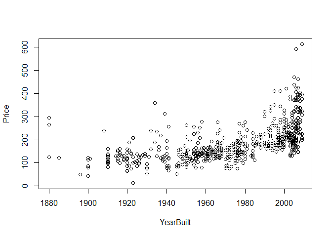
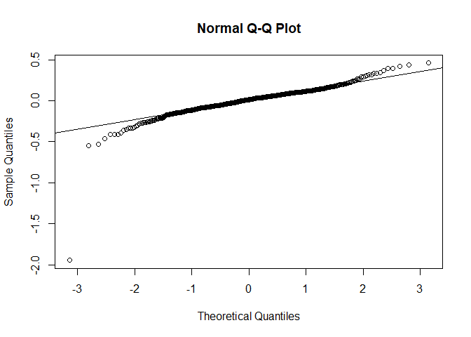

Ames Housing Prices
================
Brian Yi, Alexa Edwards, Erica Chen, Minerva Fang

Introduction
============

**Purpose:** The purpose of this project is to develop and validate a model that can assist with prospective house owners in estimating house prices depending on the qualities they are looking for in their future home.

**Method of Approach:** This group project focuses on building and testing a multivariate linear regression model from the Ames Housing dataset. Our dataset is split between a training set that is used to "train" our model, and a testing set that we "test" our model on. First, we use best subsets regression, backward elimination, forward selection, and step-wise regression to build our initial model. We conduct some individual t-tests for slope to measure the significance of the predictors in our model. We also exmaine the variance inflation factor (VIF) to detect any multicollinearity between our predictors. Next, we do some residual analysis through residual vs fits plots, histogram distributions, and normal quantile plots. We also compute standarized residuals to pinpoint potential outliers.

Our initial model has some insignificant variables so we transform these predictors so that they have a stronger correlation with our response variable, `Price`. With this transformed model, we conduct the same hypothesis tests and residual analysis that we did for our initial model. Finally, we cross-validate our transformed model with the testing set to evaluate its effectiveness in predicting house prices. To finish our report, we take our final model out for a spin by predicting a particular housing price to see if the results are reasonable.

**Results:** Our final transformed model fits our data well and fulfills all the metrics that we evaluated it with. There are a couple of things about how our methodology can be potentially lacking that will be addressed thoroughly in the conclusion.

Build an Initial Model
======================

Best Subsets Regression
-----------------------

We will first use best subsets regression to find our initial model. This method investigates the adjusted R-squared and Mallows' Cp values of different models created with various subsets of predictors.

``` r
# Model with all the possible predictors
Full = lm(formula = Price ~ LotFrontage + LotArea + Quality + Condition + YearBuilt + YearRemodel + BasementSF + GroundSF + BasementFBath + BasementHBath + FullBath + HalfBath + Bedroom + TotalRooms + Fireplaces + GarageCars + GarageSF + WoodDeckSF + OpenPorchSF + EnclosedPorchSF + ScreenPorchSF, data = Ames)

# Finding all possible subsets/models
all = regsubsets(Price ~ LotFrontage + LotArea + Quality + Condition + YearBuilt + YearRemodel + BasementSF + GroundSF + BasementFBath + BasementHBath + FullBath + HalfBath + Bedroom + TotalRooms + Fireplaces + GarageCars + GarageSF + WoodDeckSF + OpenPorchSF + EnclosedPorchSF + ScreenPorchSF, data = Ames, nbest = 2, nvmax = 30)

# Method for visualizing our results
ShowSubsets = function(regout){
  z = summary(regout)
  q = as.data.frame(z$outmat)
  q$Rsq = round(z$rsq * 100, 2)
  q$adjRsq = round(z$adjr2 * 100, 2)
  q$Cp = round(z$cp, 2)
  return(q)
}

ShowSubsets(all)
```

The higher the R-squared value of a linear model, the better that model fits the data. Since we are conducting a multivariate analysis, we will look at adjusted R-squared that also accounts for adding predictors that don't improve our model. There are a few models, 15(1), 16(1), 16(2), 17(1), 17(2), 18(1), with the highest adjusted R-squared value of 85.19 so we look at another metric, Mallow's Cp, to help shed some light on the predictors not in the model. As a general rule, a smaller Mallow's Cp indicates a better model. Model 15(1) has the smallest Cp of 13.31 while still having the higest adjusted R-squared value of 85.19, indicating that it is the best model by this method. However, this does not rule out the other models listed because their Mallows' Cp values are all less than k + 1 (k being the number of predictors); in other words, the other models I mentioned above also have very little to no bias in predicted responses.

Our best model based off of R-squared and Mallow's Cp is the following:

``` r
# Best model from best subsets regression
modAmes = lm(formula = Price ~ LotFrontage + LotArea + Quality + Condition + YearBuilt + 
    YearRemodel + BasementSF + GroundSF + BasementFBath + FullBath + 
    Bedroom + TotalRooms + Fireplaces + GarageSF + ScreenPorchSF, data = Ames)
```

We now run backward elimination, forward selection, and step-wise regression to determine whether the initial model we selected is the best fit for our data.

Backward Elimination
--------------------

We conduct backward elimination first because it requires fitting fewer models but still leaves us with only significant predictors. Backward elimination starts with the full model (with all the predictors) and then takes out any predictor with a p-value above our 5% criterion individually until we reach our desired model.

``` r
# Backward elimination
MSE = (summary(Full)$sigma)^2
step(Full, scale = MSE)
```

    ## Start:  AIC=22
    ## Price ~ LotFrontage + LotArea + Quality + Condition + YearBuilt + 
    ##     YearRemodel + BasementSF + GroundSF + BasementFBath + BasementHBath + 
    ##     FullBath + HalfBath + Bedroom + TotalRooms + Fireplaces + 
    ##     GarageCars + GarageSF + WoodDeckSF + OpenPorchSF + EnclosedPorchSF + 
    ##     ScreenPorchSF
    ## 
    ##                   Df Sum of Sq    RSS      Cp
    ## - GarageCars       1         1 531673  20.001
    ## - OpenPorchSF      1        76 531748  20.082
    ## - HalfBath         1       313 531985  20.340
    ## - WoodDeckSF       1       898 532569  20.976
    ## - BasementHBath    1       906 532578  20.985
    ## - EnclosedPorchSF  1       941 532612  21.023
    ## - FullBath         1      1826 533498  21.986
    ## <none>                         531672  22.000
    ## - ScreenPorchSF    1      3364 535035  23.657
    ## - YearRemodel      1      3903 535575  24.243
    ## - TotalRooms       1      4269 535941  24.641
    ## - GarageSF         1      4666 536338  25.073
    ## - Condition        1      5210 536881  25.664
    ## - Fireplaces       1      9063 540735  29.853
    ## - LotFrontage      1      9331 541003  30.145
    ## - Bedroom          1      9394 541066  30.212
    ## - BasementFBath    1     21221 552893  43.071
    ## - YearBuilt        1     23034 554706  45.041
    ## - LotArea          1     25963 557635  48.225
    ## - GroundSF         1     59609 591281  84.804
    ## - BasementSF       1     65785 597456  91.517
    ## - Quality          1     79104 610776 105.997
    ## 
    ## Step:  AIC=20
    ## Price ~ LotFrontage + LotArea + Quality + Condition + YearBuilt + 
    ##     YearRemodel + BasementSF + GroundSF + BasementFBath + BasementHBath + 
    ##     FullBath + HalfBath + Bedroom + TotalRooms + Fireplaces + 
    ##     GarageSF + WoodDeckSF + OpenPorchSF + EnclosedPorchSF + ScreenPorchSF
    ## 
    ##                   Df Sum of Sq    RSS      Cp
    ## - OpenPorchSF      1        75 531748  18.083
    ## - HalfBath         1       315 531988  18.344
    ## - WoodDeckSF       1       897 532570  18.977
    ## - BasementHBath    1       908 532581  18.988
    ## - EnclosedPorchSF  1       947 532620  19.031
    ## - FullBath         1      1835 533507  19.996
    ## <none>                         531673  20.001
    ## - ScreenPorchSF    1      3363 535036  21.657
    ## - YearRemodel      1      3903 535575  22.244
    ## - TotalRooms       1      4304 535977  22.681
    ## - Condition        1      5210 536882  23.665
    ## - Fireplaces       1      9119 540792  27.915
    ## - LotFrontage      1      9333 541006  28.148
    ## - Bedroom          1      9425 541098  28.248
    ## - GarageSF         1     13019 544692  32.155
    ## - BasementFBath    1     21230 552903  41.081
    ## - YearBuilt        1     23349 555022  43.385
    ## - LotArea          1     26020 557693  46.288
    ## - GroundSF         1     59609 591281  82.804
    ## - BasementSF       1     65837 597510  89.575
    ## - Quality          1     79400 611073 104.320
    ## 
    ## Step:  AIC=18.08
    ## Price ~ LotFrontage + LotArea + Quality + Condition + YearBuilt + 
    ##     YearRemodel + BasementSF + GroundSF + BasementFBath + BasementHBath + 
    ##     FullBath + HalfBath + Bedroom + TotalRooms + Fireplaces + 
    ##     GarageSF + WoodDeckSF + EnclosedPorchSF + ScreenPorchSF
    ## 
    ##                   Df Sum of Sq    RSS      Cp
    ## - HalfBath         1       351 532099  16.465
    ## - WoodDeckSF       1       863 532611  17.021
    ## - BasementHBath    1       893 532641  17.054
    ## - EnclosedPorchSF  1       960 532708  17.127
    ## - FullBath         1      1768 533516  18.005
    ## <none>                         531748  18.083
    ## - ScreenPorchSF    1      3360 535108  19.735
    ## - YearRemodel      1      3941 535688  20.367
    ## - TotalRooms       1      4279 536026  20.734
    ## - Condition        1      5141 536889  21.672
    ## - Fireplaces       1      9178 540926  26.061
    ## - LotFrontage      1      9362 541109  26.260
    ## - Bedroom          1      9443 541191  26.348
    ## - GarageSF         1     13128 544876  30.355
    ## - BasementFBath    1     21499 553246  39.455
    ## - YearBuilt        1     23382 555130  41.503
    ## - LotArea          1     26446 558194  44.833
    ## - GroundSF         1     59958 591706  81.265
    ## - BasementSF       1     66228 597976  88.082
    ## - Quality          1     79344 611091 102.340
    ## 
    ## Step:  AIC=16.46
    ## Price ~ LotFrontage + LotArea + Quality + Condition + YearBuilt + 
    ##     YearRemodel + BasementSF + GroundSF + BasementFBath + BasementHBath + 
    ##     FullBath + Bedroom + TotalRooms + Fireplaces + GarageSF + 
    ##     WoodDeckSF + EnclosedPorchSF + ScreenPorchSF
    ## 
    ##                   Df Sum of Sq    RSS      Cp
    ## - BasementHBath    1       838 532936  15.375
    ## - WoodDeckSF       1       845 532944  15.383
    ## - EnclosedPorchSF  1       976 533075  15.525
    ## <none>                         532099  16.465
    ## - FullBath         1      2643 534742  17.338
    ## - ScreenPorchSF    1      3607 535706  18.386
    ## - YearRemodel      1      3772 535871  18.565
    ## - TotalRooms       1      4206 536304  19.037
    ## - Condition        1      5145 537243  20.057
    ## - LotFrontage      1      9056 541155  24.309
    ## - Fireplaces       1      9375 541474  24.657
    ## - Bedroom          1      9488 541587  24.779
    ## - GarageSF         1     12858 544957  28.443
    ## - BasementFBath    1     21203 553302  37.515
    ## - LotArea          1     26402 558501  43.167
    ## - YearBuilt        1     27977 560076  44.880
    ## - BasementSF       1     73589 605687  94.465
    ## - GroundSF         1     78088 610187  99.357
    ## - Quality          1     81775 613874 103.366
    ## 
    ## Step:  AIC=15.38
    ## Price ~ LotFrontage + LotArea + Quality + Condition + YearBuilt + 
    ##     YearRemodel + BasementSF + GroundSF + BasementFBath + FullBath + 
    ##     Bedroom + TotalRooms + Fireplaces + GarageSF + WoodDeckSF + 
    ##     EnclosedPorchSF + ScreenPorchSF
    ## 
    ##                   Df Sum of Sq    RSS      Cp
    ## - EnclosedPorchSF  1       930 533867  14.386
    ## - WoodDeckSF       1       939 533876  14.396
    ## <none>                         532936  15.375
    ## - FullBath         1      2528 535464  16.123
    ## - YearRemodel      1      3748 536684  17.449
    ## - TotalRooms       1      4076 537013  17.807
    ## - ScreenPorchSF    1      4257 537193  18.003
    ## - Condition        1      5541 538478  19.399
    ## - LotFrontage      1      8664 541600  22.794
    ## - Bedroom          1      9208 542145  23.386
    ## - Fireplaces       1      9460 542396  23.659
    ## - GarageSF         1     12920 545857  27.421
    ## - BasementFBath    1     20377 553313  35.527
    ## - LotArea          1     27333 560270  43.090
    ## - YearBuilt        1     28044 560981  43.863
    ## - BasementSF       1     75511 608447  95.466
    ## - GroundSF         1     77585 610521  97.720
    ## - Quality          1     81248 614185 101.703
    ## 
    ## Step:  AIC=14.39
    ## Price ~ LotFrontage + LotArea + Quality + Condition + YearBuilt + 
    ##     YearRemodel + BasementSF + GroundSF + BasementFBath + FullBath + 
    ##     Bedroom + TotalRooms + Fireplaces + GarageSF + WoodDeckSF + 
    ##     ScreenPorchSF
    ## 
    ##                 Df Sum of Sq    RSS      Cp
    ## - WoodDeckSF     1       853 534720  13.314
    ## <none>                       533867  14.386
    ## - FullBath       1      2682 536549  15.302
    ## - YearRemodel    1      3862 537729  16.585
    ## - ScreenPorchSF  1      3939 537806  16.668
    ## - TotalRooms     1      3983 537850  16.717
    ## - Condition      1      5291 539158  18.139
    ## - Fireplaces     1      9084 542951  22.262
    ## - LotFrontage    1      9146 543012  22.329
    ## - Bedroom        1      9187 543054  22.374
    ## - GarageSF       1     12940 546807  26.454
    ## - BasementFBath  1     20413 554280  34.578
    ## - LotArea        1     27542 561409  42.329
    ## - YearBuilt      1     27631 561498  42.425
    ## - BasementSF     1     75707 609573  94.690
    ## - GroundSF       1     79100 612967  98.379
    ## - Quality        1     83496 617363 103.158
    ## 
    ## Step:  AIC=13.31
    ## Price ~ LotFrontage + LotArea + Quality + Condition + YearBuilt + 
    ##     YearRemodel + BasementSF + GroundSF + BasementFBath + FullBath + 
    ##     Bedroom + TotalRooms + Fireplaces + GarageSF + ScreenPorchSF
    ## 
    ##                 Df Sum of Sq    RSS      Cp
    ## <none>                       534720  13.314
    ## - FullBath       1      2740 537460  14.293
    ## - ScreenPorchSF  1      3855 538575  15.505
    ## - TotalRooms     1      3949 538669  15.607
    ## - YearRemodel    1      4009 538729  15.673
    ## - Condition      1      5839 540560  17.662
    ## - LotFrontage    1      8800 543520  20.881
    ## - Bedroom        1      9207 543928  21.324
    ## - Fireplaces     1      9313 544033  21.439
    ## - GarageSF       1     13147 547867  25.607
    ## - BasementFBath  1     20922 555642  34.059
    ## - LotArea        1     27558 562279  41.274
    ## - YearBuilt      1     29068 563789  42.915
    ## - BasementSF     1     76110 610831  94.057
    ## - GroundSF       1     82561 617281 101.069
    ## - Quality        1     82817 617537 101.348

    ## 
    ## Call:
    ## lm(formula = Price ~ LotFrontage + LotArea + Quality + Condition + 
    ##     YearBuilt + YearRemodel + BasementSF + GroundSF + BasementFBath + 
    ##     FullBath + Bedroom + TotalRooms + Fireplaces + GarageSF + 
    ##     ScreenPorchSF, data = Ames)
    ## 
    ## Coefficients:
    ##   (Intercept)    LotFrontage        LotArea        Quality      Condition  
    ##    -1.299e+03      1.210e-01      9.368e-04      1.639e+01      3.528e+00  
    ##     YearBuilt    YearRemodel     BasementSF       GroundSF  BasementFBath  
    ##     4.161e-01      1.932e-01      3.891e-02      5.537e-02      1.271e+01  
    ##      FullBath        Bedroom     TotalRooms     Fireplaces       GarageSF  
    ##    -6.053e+00     -7.553e+00      3.410e+00      7.352e+00      3.091e-02  
    ## ScreenPorchSF  
    ##     5.016e-02

Turns out, backward elimination also yields the model with the same fifteen predictors as the one discovered from best subsets regression!

Forward Selection
-----------------

Backward elimination has numerous drawbacks such as eliminating a variable early on that might have significance later on. Therefore, we decide to use forward selection that starts with the single best predictor and then adds onto it until there are no more significant predictors to add to our model. *We don't show the output of forward selection for length purposes of this report.*

``` r
# Forward selection
MSE = (summary(Full)$sigma)^2
none = lm(Price ~ 1, data = Ames)
step(none, scope = list(upper = Full), scale = MSE, direction = "forward")
```

Forward selection also chooses the model with the same fifteen variables that we have in the previously built models.

Step-wise Regression
--------------------

Forward selection also has its disadvantages since a predictor selected earlier might become insignificant later on and only serve to crowd the model. Therefore, we decide to use step-wise regression to cover for the disadvantages seen in backward elimination and forward selection. *Again, we don't show the output of step-wise selection for length purposes of this report.*

``` r
# Step-wise Regression
MSE = (summary(Full)$sigma)^2
none = lm(Price ~ 1, data = Ames)
step(none, scope = list(upper = Full), scale = MSE)
```

Although a bit tedious, step-wise regression also yields the same fifteen predictor model we found earlier. Since all four methods fitted the same fifteen-predictor model, we decide to settle with it as our initial model and move on to evaluating it.

Scatterplots
------------

We first plot the individual scatterplots between the fifteen predictors and `price`.

``` r
# Scatterplots of each predictor with price
plot(Price ~ LotFrontage + LotArea + Quality + Condition + YearBuilt + 
    YearRemodel + BasementSF + GroundSF + BasementFBath + FullBath + 
    Bedroom + TotalRooms + Fireplaces + GarageSF + ScreenPorchSF, data = Ames)
```



When it comes to parts of a house, I feel that the more you have, whether it is the number of rooms or square footage of the ground floor, the more desirable it becomes for the owner. The scatterplots all follow this assumption in that as the individual predictors increase in amount, so does `price`. For example, let us take a look at `GroundSF`. As `GroundSF` increases, `price` also increases since the amount of square feet of a house is probably a factor many people value in their house. We won't analyze the plots one by one here, but later on we will transform our model using these individual scatterplots.

Predictor Analysis
------------------

Next we investigate to see if any of the predictors in our model are not significant at the 5% level through individual t-tests.

``` r
summary(modAmes)
```

    ## 
    ## Call:
    ## lm(formula = Price ~ LotFrontage + LotArea + Quality + Condition + 
    ##     YearBuilt + YearRemodel + BasementSF + GroundSF + BasementFBath + 
    ##     FullBath + Bedroom + TotalRooms + Fireplaces + GarageSF + 
    ##     ScreenPorchSF, data = Ames)
    ## 
    ## Residuals:
    ##     Min      1Q  Median      3Q     Max 
    ## -103.65  -16.94   -2.41   13.44  212.18 
    ## 
    ## Coefficients:
    ##                 Estimate Std. Error t value Pr(>|t|)    
    ## (Intercept)   -1.299e+03  1.773e+02  -7.328 7.81e-13 ***
    ## LotFrontage    1.210e-01  3.903e-02   3.100 0.002028 ** 
    ## LotArea        9.368e-04  1.708e-04   5.486 6.13e-08 ***
    ## Quality        1.639e+01  1.724e+00   9.510  < 2e-16 ***
    ## Condition      3.528e+00  1.397e+00   2.525 0.011822 *  
    ## YearBuilt      4.161e-01  7.385e-02   5.634 2.73e-08 ***
    ## YearRemodel    1.932e-01  9.235e-02   2.093 0.036824 *  
    ## BasementSF     3.891e-02  4.268e-03   9.117  < 2e-16 ***
    ## GroundSF       5.537e-02  5.831e-03   9.496  < 2e-16 ***
    ## BasementFBath  1.271e+01  2.660e+00   4.780 2.22e-06 ***
    ## FullBath      -6.053e+00  3.499e+00  -1.730 0.084189 .  
    ## Bedroom       -7.553e+00  2.382e+00  -3.171 0.001598 ** 
    ## TotalRooms     3.410e+00  1.642e+00   2.077 0.038265 *  
    ## Fireplaces     7.352e+00  2.305e+00   3.189 0.001503 ** 
    ## GarageSF       3.091e-02  8.157e-03   3.789 0.000167 ***
    ## ScreenPorchSF  5.016e-02  2.445e-02   2.052 0.040630 *  
    ## ---
    ## Signif. codes:  0 '***' 0.001 '**' 0.01 '*' 0.05 '.' 0.1 ' ' 1
    ## 
    ## Residual standard error: 30.26 on 584 degrees of freedom
    ## Multiple R-squared:  0.8556, Adjusted R-squared:  0.8519 
    ## F-statistic: 230.8 on 15 and 584 DF,  p-value: < 2.2e-16

The `FullBath` predictor is the only predictor in the model that is not significant. Even though the slope of `FullBath` is not significant in this model, it has meaningful correlation with the other variables such that without it, the model would suffer in its capability to predict `price`.

Multicollinearity
-----------------

We look at variance inflation factors (VIF) to detect multicollinearity between predictors. Multicollinearity is when predictors have a correlation with each other that may have a negative effect on your model.

``` r
vif(modAmes)
```

    ##   LotFrontage       LotArea       Quality     Condition     YearBuilt 
    ##      1.080436      1.182043      3.514827      1.439209      3.277265 
    ##   YearRemodel    BasementSF      GroundSF BasementFBath      FullBath 
    ##      2.312571      1.859100      5.031492      1.256649      2.369758 
    ##       Bedroom    TotalRooms    Fireplaces      GarageSF ScreenPorchSF 
    ##      2.469638      3.963197      1.479378      1.858415      1.046934

In general, VIF values close to 1 indicate that the predictors don't have much correlation, VIF of 1-5 indicates moderate correlation, and VIF &gt;5 indicates high correlation. All VIF values are less than 5 with the exception of `GroundSF`, which has a VIF of 5.031492. Thus, `GroundSF` exhibits multicollinearity with respect to the other predictors in the model and is a variable we should transform or consider removing.

Residual Analysis for Initial Model
===================================

We do some residual analysis to check for some basic assumptions of our linear regression model. These basic conditions include linearity, constant variance, and normality.

Residuals vs Fits Plot
----------------------

We start off with a Residuals vs Fits Plot to assess the linearity and variance of our model.

``` r
plot(modAmes$residuals~modAmes$fitted.values, data = Ames)
abline(0,0)
```


The residuals are centered around zero overall, which is what we want to see in a residuals vs fits plot. However, there is a distinct curvature to our plot indicating that linearity does not hold too well. The curved pattern is also responsible for the non-constant variance since the variance increases at the left and right sides of this plot.

Normal Quantile Plot and Histogram
----------------------------------

We look at a normal quantile plot and a residual histogram to evaluate the normality of our model.

``` r
# Normal quantile plot
qqnorm(modAmes$residuals)
qqline(modAmes$residuals)
```


``` r
hist(modAmes$residuals)
```


If the residuals are normally distributed, our data will form a diagonal line in the normal quantile plot. In we look at the plot, most of the data sticks well to the line. However, there are a few points that are off the line at the left of the model, and a noticeable amount that is skewed at the upper right portion of the model, making us slightly concerned about the normality of the model.

The histogram of the residuals again show that most of the residuals is centered around zero, backing up our residual vs fits plot analysis. Furthermore, the histogram shows that the residuals are normally distributed with a slight right skew, wich correlates with what we saw in our normal quantile plot.

Standarized Residuals
---------------------

Our last step in residual analysis is looking at standarized residuals to detect any outliers in our dataset.

``` r
# Creating dataframe of standarized residuals
standard = data.frame(abs(rstandard(modAmes)))

# Picking the ten greatest residuals
standard %>%
  arrange(desc(abs.rstandard.modAmes..)) %>% 
  head(10)
```

    ##    abs.rstandard.modAmes..
    ## 1                 7.243089
    ## 2                 5.384715
    ## 3                 4.545594
    ## 4                 4.423855
    ## 5                 4.250074
    ## 6                 4.032905
    ## 7                 3.522869
    ## 8                 3.077526
    ## 9                 3.006536
    ## 10                2.733407

Standardized residual values that are greater than 3 are considered extreme and potential outliers. Therefore, we look for any observations in our dataset that have an absolute residual value greater than 3. We see 9 values that are greater than 3 that can be considered as outliers in our data. One way to improve our model is to remove these outliers; we leave them in for now since these 9 points are less than 2% of our training dataset, and we also plan on transforming our model which may eliminate some of these outliers.

Building a Better Model
=======================

Transforming our Initial Model
------------------------------

Even though our initial model has decent normality and variance, it is somewhat lacking in linearity. We now want to fix some of these aspects of our initial model by transforming some of the predictors.

``` r
# Transformed model
modAmes2 = lm(log(Price) ~ log(LotFrontage + LotArea) + I(Quality^2 + Condition) + I(YearBuilt + .5 * YearRemodel) + (BasementSF) + (GroundSF) + I(.5 * BasementFBath + .5 * FullBath) + I(Bedroom + TotalRooms) + Fireplaces + I(GarageSF + ScreenPorchSF), data = Ames)
```

We grouped variables together that we felt had some correlation with one another. For example, `Bedroom` and `TotalRooms` may be valued in a similar fashion between prospective buyers since more rooms are always better. We also made logistic and linear transformations that improved the linearity relationships seen in the individual scatterplots we plotted earlier. Next, we conduct similar model evaluation and residual analysis we did for our initial model.

Evaluating Transformed Model
----------------------------

We start off our analysis of our transformed model by looking at the adjusted R-squared value as well as the residual standard error. Once again, we also want to see which of our predictors are significant through individual t-tests.

``` r
summary(modAmes2)
```

    ## 
    ## Call:
    ## lm(formula = log(Price) ~ log(LotFrontage + LotArea) + I(Quality^2 + 
    ##     Condition) + I(YearBuilt + 0.5 * YearRemodel) + (BasementSF) + 
    ##     (GroundSF) + I(0.5 * BasementFBath + 0.5 * FullBath) + I(Bedroom + 
    ##     TotalRooms) + Fireplaces + I(GarageSF + ScreenPorchSF), data = Ames)
    ## 
    ## Residuals:
    ##      Min       1Q   Median       3Q      Max 
    ## -1.94457 -0.07260  0.01311  0.08606  0.45794 
    ## 
    ## Coefficients:
    ##                                           Estimate Std. Error t value
    ## (Intercept)                             -5.020e+00  7.602e-01  -6.604
    ## log(LotFrontage + LotArea)               1.136e-01  1.461e-02   7.780
    ## I(Quality^2 + Condition)                 7.311e-03  6.716e-04  10.886
    ## I(YearBuilt + 0.5 * YearRemodel)         2.759e-03  2.576e-04  10.709
    ## BasementSF                               1.598e-04  2.173e-05   7.354
    ## GroundSF                                 2.755e-04  2.844e-05   9.686
    ## I(0.5 * BasementFBath + 0.5 * FullBath)  5.145e-02  2.337e-02   2.201
    ## I(Bedroom + TotalRooms)                 -1.154e-02  5.021e-03  -2.298
    ## Fireplaces                               5.063e-02  1.146e-02   4.418
    ## I(GarageSF + ScreenPorchSF)              8.896e-05  3.985e-05   2.232
    ##                                         Pr(>|t|)    
    ## (Intercept)                             8.94e-11 ***
    ## log(LotFrontage + LotArea)              3.26e-14 ***
    ## I(Quality^2 + Condition)                 < 2e-16 ***
    ## I(YearBuilt + 0.5 * YearRemodel)         < 2e-16 ***
    ## BasementSF                              6.46e-13 ***
    ## GroundSF                                 < 2e-16 ***
    ## I(0.5 * BasementFBath + 0.5 * FullBath)   0.0281 *  
    ## I(Bedroom + TotalRooms)                   0.0219 *  
    ## Fireplaces                              1.18e-05 ***
    ## I(GarageSF + ScreenPorchSF)               0.0260 *  
    ## ---
    ## Signif. codes:  0 '***' 0.001 '**' 0.01 '*' 0.05 '.' 0.1 ' ' 1
    ## 
    ## Residual standard error: 0.1568 on 590 degrees of freedom
    ## Multiple R-squared:  0.8583, Adjusted R-squared:  0.8562 
    ## F-statistic: 397.2 on 9 and 590 DF,  p-value: < 2.2e-16

Our new model has a higher adjusted R-squared value of 0.8562 (old model: 0.8519). However, our residual standard error is 0.1568, which is way too close to 0, making us think that our model may be overfitting the training set. We will find out whether this is the case when we look at the testing set. After various transformations, we are happy to see that all of the predictors are within the 5% significance interval.

Residual vs Fits Plot
---------------------

``` r
plot(modAmes2$residuals~modAmes$fitted.values, data = Ames)
abline(0,0)
```


We see that the residual vs fits plot has a much more even distribution above and below the line throughout the graph. The distinct curved pattern we saw in our initial model has been replaced by a more random distribution throughout the plot, indicating that our transformed model is a much better fit for predicting prices from our data and that linearity holds. Furthermore, variance seems constant throughout.

Normal Quantile Plot and Histogram
----------------------------------

``` r
# Normal quantile plot
qqnorm(modAmes2$residuals)
qqline(modAmes2$residuals)
```



``` r
hist(modAmes2$residuals)
```


The normal quantile plot shows that most of the points throughout the data sticks better to the line as compared to before. The left and right tails show less of a skew as compared to before, and this is matched in our histogram, which shows a normal distribution. Altogether, this is indicative that our transformed model preserves normality better than our initial model. This analysis is not surprising considering that our standard residual error was so close to zero.

Standarized Residuals
---------------------

``` r
# Creating dataframe of standarized residuals
standard = data.frame(abs(rstandard(modAmes2)))

# Picking the ten greatest residuals
standard %>%
  arrange(desc(abs.rstandard.modAmes2..)) %>% 
  head(10)
```

    ##    abs.rstandard.modAmes2..
    ## 1                 12.629250
    ## 2                  3.524574
    ## 3                  3.421348
    ## 4                  2.961370
    ## 5                  2.939145
    ## 6                  2.807405
    ## 7                  2.701249
    ## 8                  2.650974
    ## 9                  2.646116
    ## 10                 2.624817

This time we see only 3 values that are strictly greater than 3 that can be considered as outliers in our data. This is a great improvement when compared to the 9 outliers that we discovered previously.

Cross-validation
----------------

We now take our final model we developed from the training set and cross-validate it with our testing set. It is important to know whether our model is a good fit for our data or if there is over/underfitting present.

``` r
# Calculating shrinkage
fitPrice = predict(modAmes2, newdata = AmesTest)
crosscorr = cor(AmesTest$Price, fitPrice)
testingRsq = crosscorr^2
trainingRsq = .8583
trainingRsq - trainingRsq
```

    ## [1] 0

We cross-validate our model by comparing the R-squared values of our model between the training and test set. We calculate the difference between the two R-squared values, otherwise known as shrinkage. For a model to be a good fit, the shrinkage must be close to 0. The shrinkage is -0.02312466, meaning that our testing data fits our model approximately 2% better than our training data. It happened just by chance that our testing set is a stronger fit for our model.

Predicting a House Price
------------------------

We now use our final model to predict the price of a house with the following characteristics.

``` r
# House price we are trying to predict
newx=data.frame(TotalRooms = 9, YearBuilt = 1995, YearRemodel = 2003, LotArea = 11060, LotFrontage = 90, Quality = 7, Condition = 5,BasementSF = 1150, BasementFBath = 0, GroundSF = 2314, Bedroom = 3, FullBath = 2, Fireplaces = 1, GarageSF = 502, ScreenPorchSF = 0)

# Prediction interval
predict.lm(modAmes2, newx, interval="prediction", level = .95)
```

    ##        fit      lwr      upr
    ## 1 5.530761 5.221046 5.840476

``` r
# Our model logistically transforms price so we have to recalculate the prediction interval accordingly
exp(c(5.530761, 5.221046, 5.840476))
```

    ## [1] 252.3359 185.1277 343.9430

When buying a house that fits the relevant characteristics listed above, we are 95% confident that the price of the house will be between 185.1277 thousand dollars and 343.9430 thousand dollars. This doesn't seem unreasonable by just looking at the overall properties of this house.

Conclusion
==========

Our initial goal of predicting the price of a house by using a linear regression model is complete. Since our final model fulfills all the assumptions of linear regression, we can say that our model predicts housing prices pretty well. We should note that this dataset is from houses in Ames, Iowa and may not be indicative of housing prices elsewhere. We should also keep in mind that the total dataset is only 800 observations, which is not a lot. Furthermore, our cross-validation methodology involves dividing our dataset into training and testing sets before import, so it could be due to chance that our model fits the testing set so well. If we want to improve our model, we would want to conduct a k-fold cross-validation to reduce the chances of this possibility.
